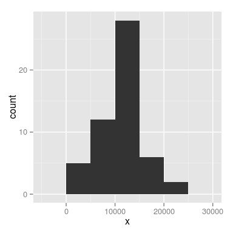
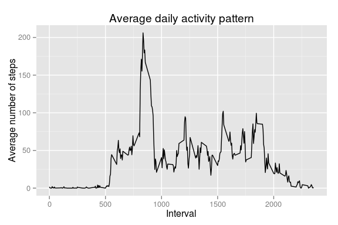
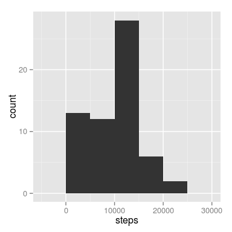
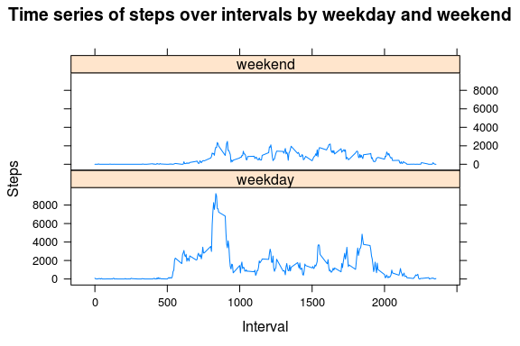

# Reproducible Research: Peer Assessment 1

## Introduction
This assignment makes use of data from a personal activity monitoring device. This device collects data at 5 minute intervals through out the day. The data consists of two months of data from an anonymous individual collected during the months of October and November, 2012 and include the number of steps taken in 5 minute intervals each day.

This study will summarise and present the the 5-minute count data at a daily scale, and make some assessment of the differences in activity between weekdays and weekends.

### Choice of libraries for analysis

The *activity* dataset provided for this assessment presents an opportunity to work with date-times variables within R. There are a range of datetime libraries available for R (such as *zoo*, *xts*, *chron* and *timeSeries*). For this assessment, the [lubridate](http://cran.r-project.org/web/packages/lubridate/index.html) package will be used.


## Loading and preprocessing the data
1. Load the data  

Unzipping the file into the default project directory, the file is loaded for review:

```r
activity <- read.csv("activity.csv")
head(activity)
```

```
##   steps       date interval
## 1    NA 2012-10-01        0
## 2    NA 2012-10-01        5
## 3    NA 2012-10-01       10
## 4    NA 2012-10-01       15
## 5    NA 2012-10-01       20
## 6    NA 2012-10-01       25
```

2. Process/transform the data (if necessary) into a suitable format for analysis  

The structure of an R object can be displayed using the **str** function. Examining the *activity* object, the variable data-types can be assessed.


```r
str(activity)
```

```
## 'data.frame':	17568 obs. of  3 variables:
##  $ steps   : int  NA NA NA NA NA NA NA NA NA NA ...
##  $ date    : Factor w/ 61 levels "2012-10-01","2012-10-02",..: 1 1 1 1 1 1 1 1 1 1 ...
##  $ interval: int  0 5 10 15 20 25 30 35 40 45 ...
```

The *date* and *interval* columns appear to represent the date and time at the start of the 5 minute interval for which *steps* have been counted.

To transform this to a time-series of counts, the *date* and *interval* columns will be used to create a new POSIXct datetime column in the dataframe called *datetime*. 


```r
#install.packages("lubridate","ggplot2")
library(lubridate)

activity$time_str <- sprintf("%04d",activity$interval)        # Adding zeros to 
activity$time_str <- paste(activity$time_str,"00",sep="")     # format time as hhmmss;
activity$date_str <- paste(activity$date,activity$time_str)   # concatenate date and time;
activity$datetime <- ymd_hms(activity$date_str)               # using lubridate's ymd_hms();

# Creating a new dataframe with only the columns required for the analysis
# that follows
data <- activity[,c(6,2,1,3)]
head(data)
```

```
##              datetime       date steps interval
## 1 2012-10-01 00:00:00 2012-10-01    NA        0
## 2 2012-10-01 00:05:00 2012-10-01    NA        5
## 3 2012-10-01 00:10:00 2012-10-01    NA       10
## 4 2012-10-01 00:15:00 2012-10-01    NA       15
## 5 2012-10-01 00:20:00 2012-10-01    NA       20
## 6 2012-10-01 00:25:00 2012-10-01    NA       25
```


## What is mean total number of steps taken per day?
For this part of the assignment, missing values in the dataset are ignored.  

1. Make a histogram of the total number of steps taken each day.  

The total number of steps taken each day now need to be calculated (ignoring NAs).

```r
ag <- aggregate(data$steps,by=list(category=data$date), FUN=sum)
```

Plotting the histogram:  

```r
library(ggplot2)
qplot(x,data=ag,geom="histogram", binwidth=5000)
```

 

2. Calculate and report the **mean** and **median**.


```r
summary(ag$x)[3:4]
```

```
## Median   Mean 
##  10800  10800
```


## What is the average daily activity pattern?

1. Make a time series plot.  

To examine the raw average for each time step over the two months of data collection, the following time series plot presents the average number of steps by 5 minute interval (ignoring NAs).

```r
ag <- aggregate(data$steps,by=list(category=data$interval), FUN=mean, na.rm=TRUE)

ggplot(data=ag, aes(x=category, y=x)) + geom_line() +
                ylab("Average number of steps") +
                xlab("Interval") +
                ggtitle("Average daily activity pattern")
```

 

2. Which 5 minute interval, on average, contains the maximum number of steps?   

To determine the time interval where the maximum number of steps is recorded, the simplest method is probably to sort the data.frame in decreasing order so that the maximum value is shown at the top.


```r
sort_ag <- ag[ order(ag$x,decreasing=TRUE),]
head(sort_ag)
```

```
##     category     x
## 104      835 206.2
## 105      840 195.9
## 107      850 183.4
## 106      845 179.6
## 103      830 177.3
## 101      820 171.2
```

The 5 minute interval with the highest average number of steps is **835**.


## Imputing missing values
The presence of missing days may introduce bias into some calculations or summaries of the data. 

1. Determine the number of NAs

Summing the response from the `is.na()` function will return the number of NAs for an input vector.  
`sum(is.na(data$steps))` = 2304.

2. Devise a strategy to fill missing values  

Median values for each interval will be calculated and will be applied to NA values in the dataframe. 


```r
# calculating the median value for each interval
med <- aggregate(data$steps,by=list(category=data$interval), FUN=median, na.rm=TRUE)
names(med) <- c("interval","steps")
```

3. Create a new data set with the missing values filled in  

The process used to replace NAs will be to subset out rows with NA values, merge the calculated median data with the subset, and then rebuild the full dataset.


```r
# subset out the rows with NA 
sub <- subset(data,is.na(steps))

# dropping the step variable
sub <-sub[ ,c(1:2,4)]

# performing a left-outer join to merge the in the median values
mrg <- merge(x=sub,y=med,by="interval",all.x=TRUE)

# rebuilding  & sorting full dataset
df <- rbind(subset(data,!is.na(steps)),mrg)
df <- df[ order(df$datetime),]                 # the one place the datetime variable is used!
rownames(df) <- NULL
head(df)
```

```
##              datetime       date steps interval
## 1 2012-10-01 00:00:00 2012-10-01     0        0
## 2 2012-10-01 00:05:00 2012-10-01     0        5
## 3 2012-10-01 00:10:00 2012-10-01     0       10
## 4 2012-10-01 00:15:00 2012-10-01     0       15
## 5 2012-10-01 00:20:00 2012-10-01     0       20
## 6 2012-10-01 00:25:00 2012-10-01     0       25
```

4. Make a histogram and report the mean and median as before.


```r
dfsum <- aggregate(df$steps,by=list(date=data$date), FUN=sum)
names(dfsum) <- c("date","steps")
```

Plotting the histogram:  

```r
library(ggplot2)
qplot(steps,data=dfsum,geom="histogram", binwidth=5000)
```

 

Calculate and report the **mean** and **median**.


```r
summary(dfsum$x)[3:4]
```

```
##   Mode   <NA> 
## "NULL"     NA
```

Clearly, these values differ from the mean and median values reported earlier.  

The impact of imputing missing data in this case is to lower both the mean and median values.


## Are there differences in activity patterns between weekdays and weekends?

1. Create a new factor variable in the dataset with two levels -- "weekday" and "weekend" indicating whether a given date is a weekday or weekend day.

Using the dataset with the filled-in missing values - `df`.


```r
# create weekday values from date column
df$wday <- wday(df$date)
df$wdayStr <- wday(df$date, label=TRUE,abbr=TRUE)

## Create NEW factor variable with two levels - "weekday" and "weekend"
df$dayType <- ifelse(df$wday==1,c("weekend"),ifelse(df$wday==7,c("weekend"),c("weekday")))
#head(dfsum,100)
df$dayType <- factor(df$dayType)
str(dfsum)
```

```
## 'data.frame':	61 obs. of  2 variables:
##  $ date : Factor w/ 61 levels "2012-10-01","2012-10-02",..: 1 2 3 4 5 6 7 8 9 10 ...
##  $ steps: int  1141 126 11352 12116 13294 15420 11015 1141 12811 9900 ...
```

```r
## Aggregate data as before, but this time split by factor dayType
dfsum_wday <- aggregate(df$steps,by=list(interval=df$interval,dayType=df$dayType), FUN=sum)
names(dfsum_wday) <- c("interval","dayType","steps")
head(dfsum_wday)
```

```
##   interval dayType steps
## 1        0 weekday    91
## 2        5 weekday    18
## 3       10 weekday     7
## 4       15 weekday     8
## 5       20 weekday     4
## 6       25 weekday    59
```

2. Make a panel plot for weekdays and weekends comparing average steps across 5-minute intervals


```r
require(lattice)
```

```
## Loading required package: lattice
```

```r
# scatterplots for each combination of two factors
attach(dfsum_wday)
xyplot(steps~interval|dayType ,type="l",
   main="Time series of steps over intervals by weekday and weekend", 
   ylab="Steps", xlab="Interval",layout=c(1,2))
```

 


